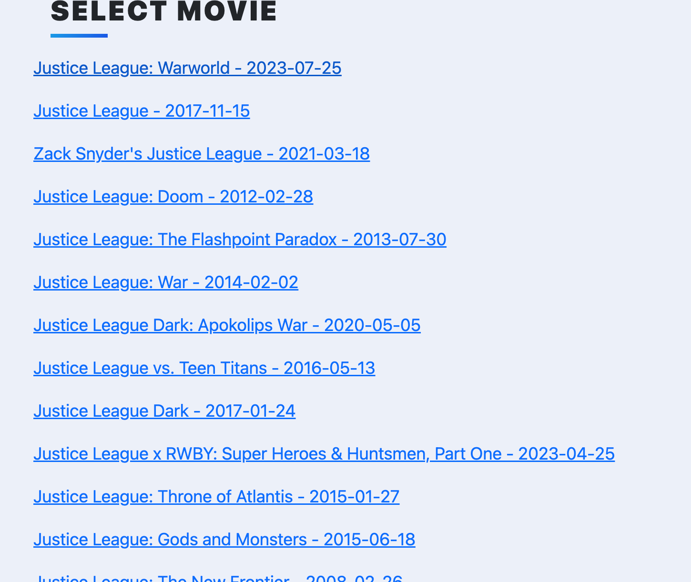

# Movie List and Database
- This project was an exercise in using my Python skills to bring together Flask, Flask-Bootstrap, and SQLAlchemy!

## What You'll See
- As you can see, when you first load the program you'll be greeted with a couple movies thanks to the already populated database

---
- Each card will afford you these options:
  - On its face, view the movie poster being loaded in. Plus, view its dynamically updated ranking number
  - Update the card's review and rating as well as see its description, title, year and rating on its back
- 
- 
---
- Further down the page you'll also be able to add a movie that'll be generated as a card too!
- 
- 

## Installation
- Here, I'll outline how you can get this project onto your machine and begin customizing your own movie  list!
1. Create a directory on your machine to house it, "MovieList" could work
   1. On Mac, use terminal for below:
   ```commandline
   mkdir MovieList
    ```
2. Look above on this page and select "Code"
3. From here, copy the HTTPS web URL
4. Return to your terminal and clone the repo
   ```commandline
   git clone https://github.com/LanoCodes/Movie-List-and-Database.git
    ```
5. I used PyCharm, but using your preferred IDE, open the MovieList project
6. There are some prequisites to actually running the project!:
   1. First you'll need to make sure that the all the requirements have been downloaded
   2. You'll then need to head over to The Movie Database to sign up for a free account
      1. Then, head to Settings-API and get an API-Key
      2. Head here next: 
         1. ```commandline
            https://developers.themoviedb.org/3/search/search-movies
            ```
            From here, grab your access token and place it where specified in main.py
7. That's it! Now you can run main.py, head over to your browser, and beginning exploring the list